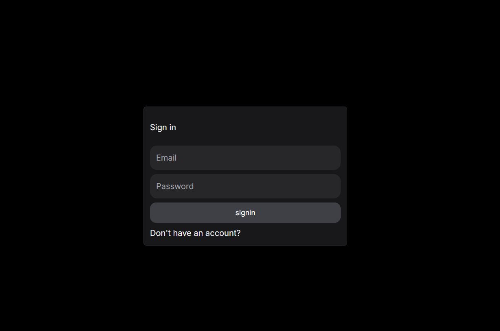

# Events Management Dashboard

This is a Next.js application designed for managing events with features including a dashboard, RSVPs, latest events, sign-in, and sign-up pages.

## Features

- **Dashboard**: View all events, manage RSVPs, and get insights into event performance.
- **RSVPs**: Users can RSVP for events and view their registered events.
- **Latest Events**: Display the most recent and upcoming events on the homepage.
- **Authentication**: Sign-in and sign-up functionality for user management.

### Mockups

<div>



</div>

## Getting Started

### Prerequisites

- Node.js (>= 20.x)
- npm or yarn

### Installation

1. Clone the repository:

   ```bash
   git clone  https://github.com/mabdullahse/nextjs-event.git
   cd nextjs-event
   ```
